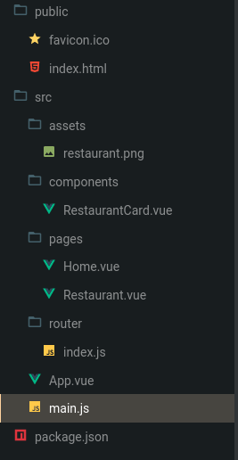
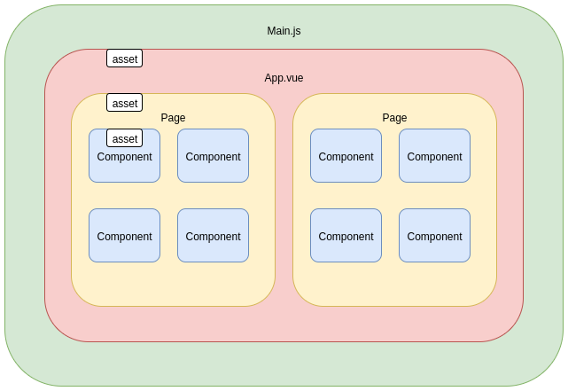
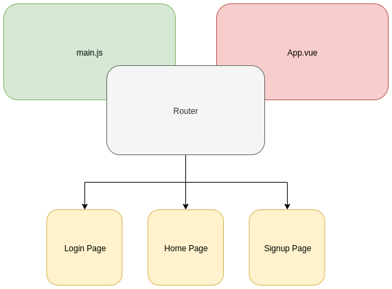

<h1 align="center" >Vue Basics - Part II</h1>

## Our app, Laduzi

The goal of Laduzi app is to rate restaurants based on a simple evaluation criteria:

> Did you or did you not get Laduzi（拉肚子）?

Laduzi in the restaurant industry is rampant and terrorizing and affecting millions
of people Beijing wide. This needs to come to an end!

Now using one app you can see the restaurants around you and see if people have
suffered Laduzi after dining there. You can also report your own Laduzi experiences
from restaurants!

Help us make Beijing a safer place to eat!

## What we did last time

### Terminology

- **HTML (HyperText Markup Language)**: Where things are and how they're structured

- **JS (Javascript)**: Sometimes called Ecmascript (ESM). It helps determine the behavious of your app.

- **CSS (Cascading Style Sheets)**: You might also see SASS or SCSS that are just extensions of CSS. I determines what things look like in your app.

- **Front-End:** Everything that you can see and on a website in the browser.

- **Vue:** Vue is a front-end framework. It makes development easier

- **SFC (Single File Component):** Have HTML, CSS, JS in the same file

- **DOM (Document Object Model):** Contains all elements in the page icluding HTML, JS, CSS and other cool stuff.
  Normally used like: "The button didn't render in the DOM"
  
- **Render:** Show something in the DOM

- **Directive:** Tools to render (show) things in the DOM

- **Tag:** HTML elements we can use on the DOM, like div or input. A good list of the basic components can be found **[here.](https://www.learn-html.org/en/Basic_Elements)**
  
- **Object:** Think about a cat. The cats name is Mr.Watson and it is red. When we formulate this as an object we get:
  ```js
   const myCat = {
     name:'Mr.Watson',
     color:'red'
   }
  ```

### Vue Single File Component (SFC)
This is a file that enables you to write the HTML, CSS and Javscript for your component in a single location.

```HTML
  <template>
    <!-- Where things are -->
  </template>

  <script>
    // what things do
  </script>

  <style lang="scss" scoped>  
    /* What things look like */
  </style>
```

### Directives

### `v-for`

Render (show) a list from an array i.e. `['banana', 'orange', 'laduzi']`

```HTML
  <div v-for="item in items" v-bind:key="index">
        {{ item }}
  </div>
```

Example for a list
```HTML
  <ul>
      <li v-for="item in items" :key="index">
        {{ item }}
      </li>
  </ul>
```

### `v-model` and declarative rendering

Bind changes in an input to a value and render (show) it in the DOM
```HTML
  <template>
    <div>
      <input v-model="inputText" type="text" />
      <div>{{inputText}}</div>
    </div>
  </template>

  <script>
    export default {
      data() {
        return {
          inputText: ''
        }
      },
    }
  </script>
```
### `v-if-else`

`v-if-else` is a simple if this then that, else do this command. 
For instance we can render a list to see if or if not a cat is our belowed
Mr.Watson

```HTML

<div v-for="cat in cats" v-bind:key="index">
            <div v-if="cat.name === 'Mr.Watson'">This is my cat! ️️️</div>
            <div v-else>This is not my cat!</div>
</div>

<script>

export default {
  data() {
    return {
      cats: [{ name: "Mr.Watson" }, { name: "Mr.Furball" }]
    };
  },
}
</script>
```

So to iterate, if `cat.name` is `'Mr.Watson'`, the operation `cat.name === 'Mr.Watson'` is true. Therefore, we show the element inside the if statement. Otherwise we show that this is not our cat in the `else` tag.

### Lifecycle hooks

Lifecycle hooks run at a certain point in a Vue components lifetime.
Last time we used the hook mounted. Basically it runs the code when everything in showing in the DOM.

There are also other ones out there, and you can learn more
about lifecycle hooks **[here](https://vuejs.org/v2/guide/instance.html#Instance-Lifecycle-Hooks)**


```HTML
 <script>
    export default {
      mounted () {
        console.log('Mounted!');
      },
    }
  </script>
```


### Event listeners

We used `@click` to react to a click event. There are others out there as well. [Take a look!](https://vuejs.org/v2/guide/events.html)


```HTML
  <template>
    <div>
     <div @click="doSomething"></div>
    </div>
  </template>
```

### Methods

Methods are functions that you can run from the code itself or
from user actions

```HTML
 <html>
  <button @click="doSomething">Click me to do something!</button>
 </html>
 <script>
    export default {
      methods: {
        doSomething() {
          console.log('I am doing something!')
        }
      }
    }
  </script>
```


## Today's Workshop

We will be covering

1. Splitting components and importing them
    - Restaurant card Component
    - Home component page
    - Restaurant component page
2. Properties
3. Routing

You will get last time's sample code to work with including samples
provided here. We will go one step at a time and give you time to
work on each problem!


## 1. Splitting components

In javascript in general you can export and import files.
It would be rather cumbersome to have everything in one file.
The same thing holds true for Vue components. Imagine having a entire
webpage in one vue component. That would become unmanageable quite quickly!

Splitting components also helps with a term called SoC, or 
Separation of Concerns. The idea is that one piece of code should handle
only one concern.

For instance the laptop you are using now is an example of separation of concerns.
You can take out the monitor and change it to a new one. The monitor does monitor things. Same goes for the keyboard and charger and so on.

Splitting things into smaller components makes the whole easier to manage!

<br />
### Splitting our project

Looking at our project what could be parts that one could take apart 
to handle one specific task?

- Restaurant card
- Button
- List
- Input

Okay, the flip side of componentization is going too overboard with it.
Literally anything on this page could be broken down into a separate file, but
that would also become unmaintainable. What if your laptops charger 
was actually made out of 1000 tiny pieces rather than from a couple of main components? Normally when developing you will notice naturally when things
should become their own components, this migth happen for instance when you find yourself scrolling through 2000 lines of code searching for that one function.
Furthermore with practice and experience you will start to get a feeling for
what should be split, and what should not. This will get easier over time!


For this workshop we will be splitting our old code into two components:

- Restaurant card (RestaurantCard.vue)
- Home (Home.vue)

Another term often used in component design is parent-child relationship.
In our case the main will contain the restaurant cards and contain data about restaurants and restaurant card will render the information about one restaurant inside a card. So since the card is inside the main, it is its child.
Remember that you can also import the main component into another component,
in which case the main becomes the child of that and so forth.

Doing multiple levels of parent-child nesting can also get complicated, so
try to keep your component design as flat as possible.

## 2. Properties

Before we can start splitting our code, we need to talk a little about something called properties.
Properties are variables that you can pass into a component. So for instance
we can pass a property of 'restaurantData' into our restaurant card and 
we can now use it inside the component


This is what the restaurant component export would look like
```HTML
 <script>
  export default {
    name:'restaurant',
    props: {
      data: {
        type: Object,
        default: {}
      },
    },
  }
</script>
```

Notice that it is good practice to define the type of data
you are passing in and also a default value.

This is how to use it in the parent component

```HTML
  <template>
    <div>
      <restaurant :data="restaurantData"></restaurant>
    </div>
  </template>

  <script>
    // You need to import your compnent so you can use it!
    import Restaurant from './restaurant-card.vue';
    export default {
      data() {
        return {
          restaurantData: {name:'pizza overload'}
        }
      },
      
    }
  </script>
```

notice that we the prop name and the inserted variable name does not
need to be the same!

### Properties - Tasks!

- Take "this.restaurants" data from Home.vue and pass then as a property from App.vue!


### Components - Splitting restaurant card

Last times code can be found here: https://codesandbox.io/s/vue-template-czgeq
As we can see in our old code we were using the directive v-for to loop over restaurants.
Our task now is to take out the two span elements inside the outer v-for and 
extract them into a separate component using what we learned previously. 

```HTML
  <ul class="list-group list-group-flush margin-bottom-10">
      <li class="list-group-item d-flex justify-content-between align-items-center"
       v-for="(restaurant, index) in restaurants" 
       :key="index">
        <span>{{restaurant.name}}</span>
        <span>
          <span v-for="count in restaurant.count" :key="count">
            <i v-if="restaurant.laduzi">💩</i>
            <i v-else>❤️</i>
          </span>
        </span>
      </li>
  </ul>
```


### Component Tasks!

- Create a restaurantCard.vue component
- Import restaurantCard.vue into Home.vue
- Render the new cards inside the v-for on Home.vue


### Understanding the Vue project structure

The main parts of a basic Vue project are these



- **public** <br/>
This is where you can put images, icons, sound files and so on. These are what we call static assets, as they are non-changing

- **src**
    All project code goes here

- **assets** <br/>
You can also put images here. Assets operates a bit differently that public because you can for instance optimize image sizes and so on. As far as you are concerned for now you can put files either into public or assets <br/> For the curious one's you can look into Webpack, a article about the subject can be found here
https://iamakulov.com/notes/optimize-images-webpack/

- **components**
Here is where all our components live
 
- **pages**
A component can also be a page, there is nothing
different in code about components vs pages, it's only a way of categorization

- **router**
We will cover this in the next section. But basically a router tells the app at which URL we should so a specific page. For instance it's common to have the login page behind "https://my-page.com/login"

- **App.vue**
Contains all the pages and components of the app. The master container and component

- **main.js**
This initializes the app and attaches the App.vue to the DOM (including anything required in App.vue)


Here is a illustration of these parts. Notice how
assets can exist on any level of a vue component!



## 2. Routing

Last thing we will cover today is routing. Routing means the action of
redirecting the user to a new page. In order for us to do that we need to tell both
main.js and App.vue that we are going to do some routing. A router kind of sits between
these two and tells which url (/login, /signup, /home) leads to which page.





For this task we have created you already a component called RestaurantCard.vue. Go
ahead and create a "RestaurantCard.vue" file in your components folder and paste in this code:

```html
 <template>
    <section class="container-fluid">
      <!-- Top Nav -->
      <nav class="row justify-content-start mb-3 ml-1 nav">
        <router-link :to="{ name: 'Home' }">
          <span>
            
          </span>
          <span> {{appName}} </span>
        </router-link>
      </nav>
      <!-- Title -->
      <header class="margin-bottom-10 center">
        <h1> {{restaurant.name}} </h1>
      </header>
      <!-- Content -->
      <main class="margin-bottom-10 center">
        <p> {{restaurant.description}} </p>
      </main>
    </section>
  </template>

  <script>
  export default {
    name: "Restaurant",
    props: {
      appName: "",
      restaurant: {
        type: Object,
        default: () => ({})
      }
    }
  };
  </script>

  <style>
  .nav {
    text-align: left;
  }
  .center {
    text-align: center;
  }
  </style>

```

Okay now we have a new page, but we want to be able to route to it at `"/restautant"`
Well in order for us to do so we need to define a router file and tell the app to do so

Create a new folder called `"router"` and then
create a file inside that folder called `index.js`. Then paste in this code

```js
import Vue from "vue";
import Router from "vue-router";
import Home from "../pages/Home.vue";
import Restaurant from "../pages/Restaurant.vue";

// Pass the router into your Vue instance
Vue.use(Router);

export default new Router({
  mode: "history", // Allows use of the "back" button
  // Define your app routes here
  routes: [
    {
      // path in the url, sometimes the path can be complex so you can also use name for routing.
      // you always do need to define the path as well!
      path: "/", 
      component: Home, // the component to show when we are visiting this route
      name: "Home", // name of the component
      props: true
    },
    {
      path: "/restaurant",
      component: Restaurant,
      name: "Restaurant",
      props: true
    }
  ]
});

```

In the end your project structure should look like this <br/> <br/>


After this we will modify our App.vue to understand to use our new routes.
You see here a new component called `<router-view />`, this is an external package
that we have added to vue to extend its functionalities.

In simple terms the router-view defines a window where we can show different pages (routes)

In `App.vue`
```HTML
<template>
  <div id="app">
    <!--
      Instead of defining your component,
      let Vue Router mount the component
      depending on your route using the "router-view"
      component. You can even pass in props directly
      and they'll be available on every page.
    -->
    <router-view appName="LA DU ZI | 拉肚子 🍴"></router-view>
  </div>
</template>

<script>
export default {
  name: "App"
};
</script>

<style>
#app {
  font-family: "Avenir", Helvetica, Arial, sans-serif;
  -webkit-font-smoothing: antialiased;
  -moz-osx-font-smoothing: grayscale;
  margin-top: 40px;
}
a {
  color: #632b2b;
}
a:hover,
a:focus {
  color: #bed346;
  text-decoration: none;
}
</style>

```

Lastly we will tell the `main.js` to use our new router


```js
import Vue from "vue"; // The official Vue instance
import App from "./App.vue"; // Your Vue app entrypoint
import router from "./router"; // Your custom router (at index.js)
import "bootstrap/dist/css/bootstrap.min.css"; // Bootstrap Styles
Vue.config.productionTip = false;

// Mount the Vue instance as soon as the page loads
new Vue({
  el: "#app",
  router,
  template: "<App/>",
  components: { App }
});
```

Ok this is great and all, but how will people actually find themselves to these pages?
In comes `<router-link />`. As you can see we can define in the HTML of any component a 
link and 

```vue
  <router-link
        class="link"
        :to="{
          path: '/restaurant', // if you have defined a name you can also use that for routing
          name: 'Restaurant',
          params: { restaurant: restaurant } // pass in properties
        }"
      >
        {{ restaurant.name }}
      </router-link>
```

### 🌮 Routing - Tasks!

- Add a router link to the RestaurantCard.vue to lead to the page of that restaurant
- Pass in the restaurant property of the RestaurantCard to the restauran page
- Create a new route! (you can also create a new page to route to)


### Completed code

You can check out the completed code here!

https://codesandbox.io/s/laduzi-app-m4dz0