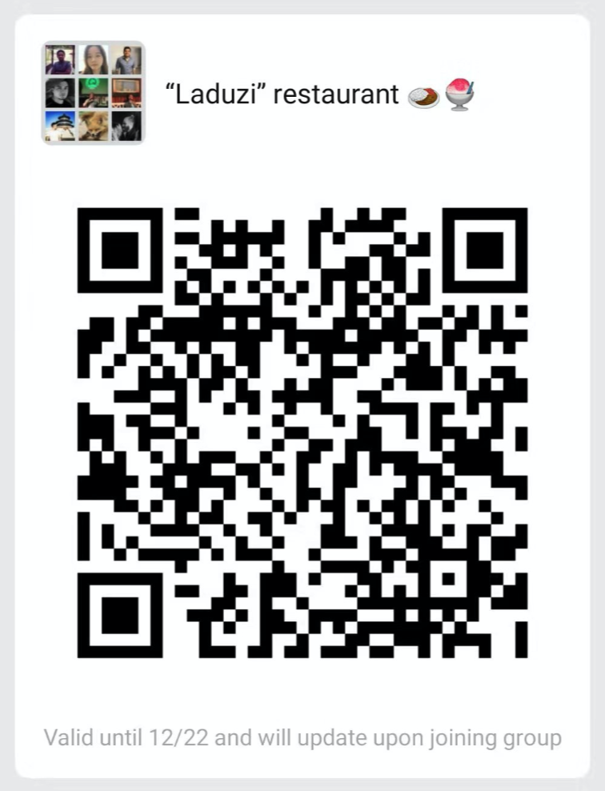
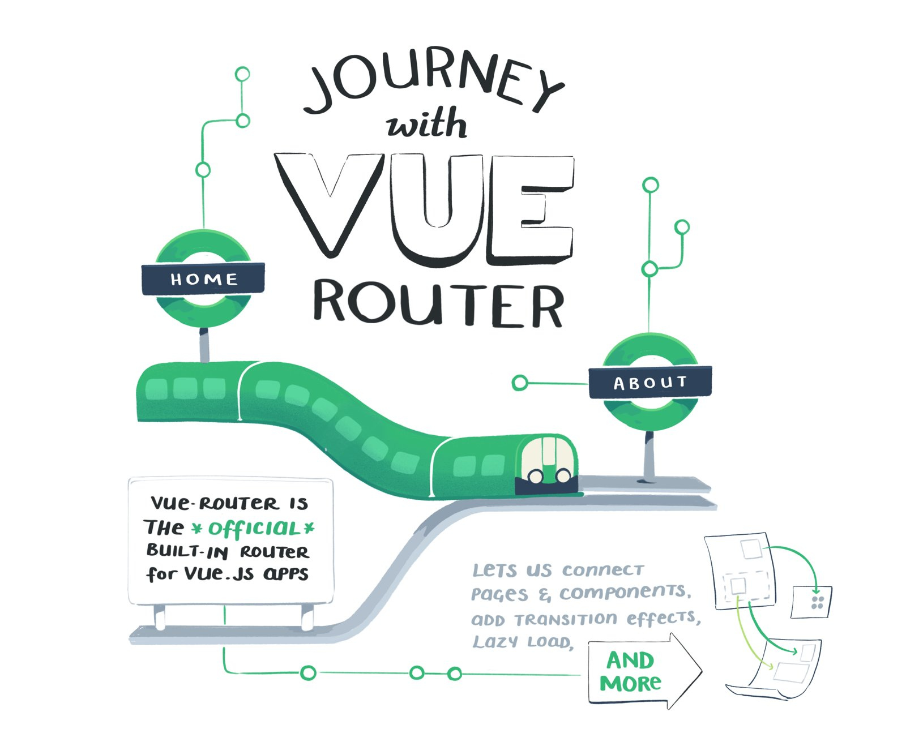
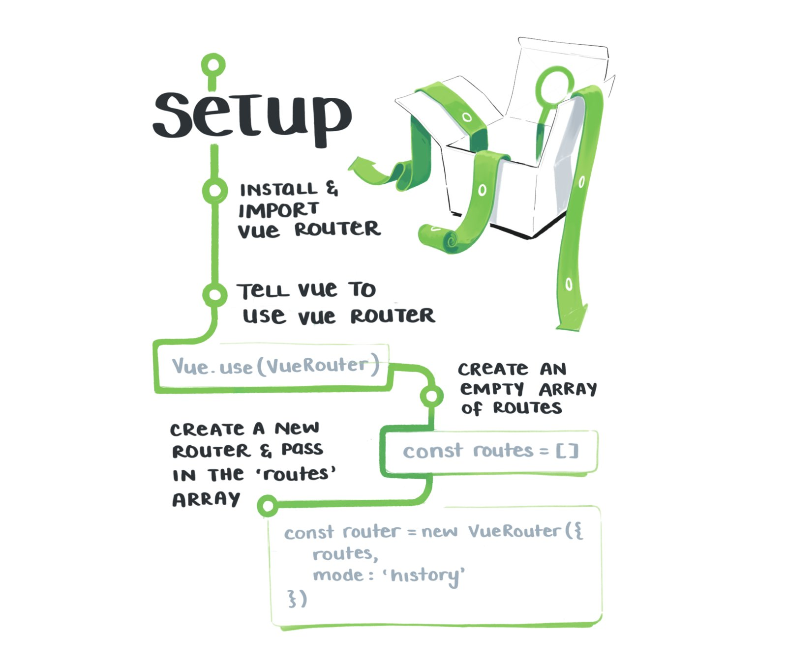
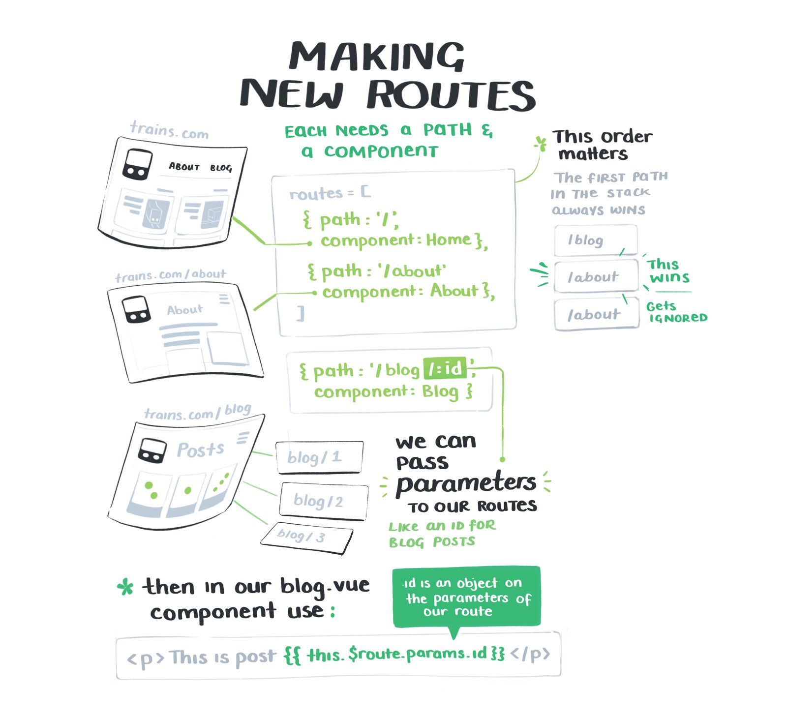
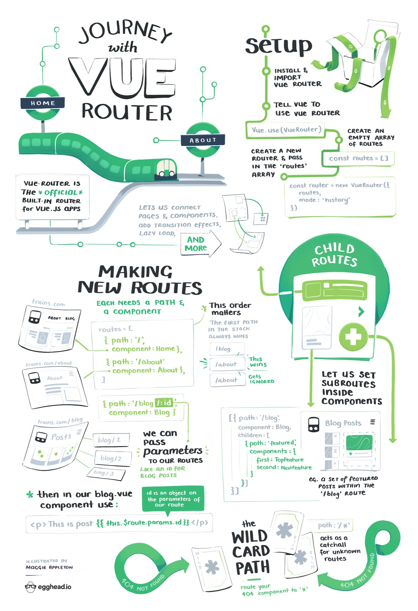

# Add routing your Vue application - Part III


## 🦥 What is routing?
The final part of this series we shall be working on is **routing**. What is routing?
Most website applications are built with more than one page. A typical web application will have a home page, a login and signup page as well as a dashboard. Each of these pages is commonly called a **route**. Basically, a route is basically a fancy term for a page. By the end of today's workshop, you'll be able to create and add routes for our Laduzi App.

Therefore, **routing is the action of redirecting your users to the different pages(routes) of your application**. 


## 📝 What will you need?
In order to progress smoothly today, you're going to need a couple of things. If you already have these things done, you can skip to the next section.
- **Github Account** - If you don't have an account with Github, you can create one **[here](https://github.com)**
- **Codesandbox Account** - After creating your Github account you can use it create an account with Codesandbox. Go ahead and do that **[here](https://codesandbox.io/)**
- You're also going to need to relax, have fun and enjoy this workshop! **Remember that we have mentors around to help you in case you encounter a problem.**
- **We have a WeChat group.** - We'll be using it to share materials during the workshop. Please scan the QR code to get started.

<center>
  
</center>

## 🔮 Router example.
Before we begin, first let's take a look at what a simple example of a Vue application with a router looks like below:

<iframe
  src="https://codesandbox.io/embed/vue-router-example-ctlg7?fontsize=14&moduleview=1&theme=dark"
  style="width:100%; height:500px; border:0; border-radius: 4px; overflow:hidden;"
  title="Vue Router Example"
  allow="geolocation; microphone; camera; midi; vr; accelerometer; gyroscope; payment; ambient-light-sensor; encrypted-media; usb"
  sandbox="allow-modals allow-forms allow-popups allow-scripts allow-same-origin"
></iframe>

The above example is really simple. In this example, there are 4 things to notice:
- We have 3 pages (routes). Namely, the `Home`, `About` and `Profile` pages.
- Our routes are configured in the `router.js` file.
- Our `App` component imports a new special component called the `RouterView` component. We'll explain what this component does in the near future.
- In the `Navbar` component, we have another special component provided by Vue called the `RouterLink` component. It serves as a link to the routes / pages in the application.


## 🥑 Let's get routing!
Now that we know what a router is and how it works, let's go ahead and create our own router for the Laduzi app. Make use of the starter given below.

### The `vue-router` plugin.
In order to implement routing, Vue gives us an official routing plugin we can use to make routing between our pages easy. In fact, it's so easy that the **[official `vue-router` documentation](https://router.vuejs.org/)** says it's a breeze. And what nice breeze it is! 😄

To get started, we just need to add it as dependency in our application on codesandbox. We do that by clicking the "Add Dependency" button on code sandbox. And Viola! `vue-router` is installed.

### Creating the router in `router.js`
As you saw in our example, we have a file called `router.js` in the `src` folder. This is the file where the magic of Vue Router happens. It's where we configured our routes. These are the steps we're going to follow:

**1. Import Vue and the router packages**: First we import `Vue` and the `Router` plugin from `vue-router`. The reason why we import them is because we're going to be using them in this file. When you're done, we go to step 2.

```js
import Vue from "vue";
import Router from "vue-router";
```

**2. Import our routes/pages**: We then import the components that we want to use as pages. Normally we'd put all pages in a single folder/directory for better organization. In our example, we've placed them in the `pages` directory.

**Whenever you see an `import` statement in a javascript file, It means that the imported asset is going to be used at a later stage in this file.**

So go ahead and import into `router.js` as shown below.

```js
import Home from "./pages/Home";
import About from "./pages/About";
import Profile from "./pages/Profile";
```

**3. Register `Router` plugin with `Vue`**: Remember to tell Vue to use the Router plugin. In Vue terms, we call this registering a plugin. This is how we register plugins in Vue. :)

```js
Vue.use(Router);
```

**4. Create our routes**: Next, we create our routes array. For each route, we determine which path should show what component. You could give each route a path that you desire. However, it's better to use a path you can easily remember. This is how we create our routes:
```js
const routes = [
  {
    path: "/",
    component: Home
  },
  {
    path: "/about",
    component: About
  },
  {
    path: "/profile",
    component: Profile
  }
];
```

**5. Create your `router` instance**: The next thing we shall do here is create our router instance. This is the instance we shall be giving to our Vue application.
We also then give the router instance our `routes` array so the `<RouterView />` component can show them for us as we shall see later.
```js
const router = new Router({
  routes: routes
});
```

**6. Export our router**: 🎉 Hooray! Now you're made our router instance. Now we need to export it from this file so we can import it in our `main.js` file.

```js
export default router;
```
### Navigation
In order to navigate our routes, we need to create anchors or links to the different pages. Thankfully, Vue makes this very easy by giving us the `<router-link />` component to serve as a link between pages. Next, we created a `Navbar.vue` component that will link us to the routes of our app that we created. In the template of the `Navbar.vue` file, we then use the `router-link` as shown below:

In `Navbar.vue`
```vue
<template>
  <router-link to="/">Home</router-link>
  <router-link to="/about">About</router-link>
  <router-link to="/profile">Profile</router-link>
</template>
```
Notice that each of the `router-link` components has a `to` prop. This prop accepts the path of the route we want it to link to.

Next we import our `Navbar.vue` component inside oue `App.vue` fileand register it as a component. We can then use it in the template.

```vue
<template>
  <div id="app">
    <!--
      We then use our Navbar here.
    -->
    <Navbar />
  </div>
</template>

<script>
/**
 *Here we import the navbar and register it as a component.
 */
import Navbar from './components/Navbar'

export default {
  name: "App",
  components: {
    Navbar
  }
};
</script>
```

With any luck, we should be able to see the nav links in your browser as shown in the image below! :)

<center>
  
</center>

### Registering the router
Now we're ready to add our router to our application!

**1. Import the router**: The next thing we need to do is import the router we just created into our `main.js` file.
In `main.js`
```js
import router from "./router";
```
**2. Register the router**: In our Vue app instance, we give the router as an option so that it can be wired up with the rest of our app.
```js
new Vue({
  router: router, // <-- Add this line :D
  render: h => h(App)
}).$mount("#app");
```

### The `RouterView` component
Bravo! Now we're ready to display our routes in our app. Vue also (as always), makes this super easy and fun too! Out of the box, Vue gives us the `RouterView` component to display the pages that we registered in our router. Adding this to our app is a sincle step.

In the template of our `App.vue` file, simply add the `<RouterView />` after the Navbar as shown below.
```vue
<template>
  <div id="app">
    <Navbar />
    <!-- 
      We add the <RouterView /> component as shown below.
     -->
    <RouterView />
  </div>
</template>

```

🏆 And voila! Our application should be ready route. Try clicking the links in the browser. You should be able to swap between the pages you created. Hooray 🎉


## 🏋🏼‍♀️ Exercise - Add Router to Laduzi.
Now that we're ready to add routing to our application, we can now add routing to our laduzi app. Use the starter below to get started.

Please open our starter application here in the browser. Since you're logged into codesandbox, you'll need to click the fork button to fork it so you can edit the files.
**Please find the ROUTING STARTER [HERE](http://bit.ly/laduzi-routing-starter)**


### 🌮 Routing - Tasks!
- Add a router link to the `RestaurantCard.vue` to lead to the page of that restaurant
- Pass in the restaurant property of the `RestaurantCard` to the restaurant page
- Create a new route! (you can also create a new page to route to)

### ✅ Solution
You can check out the completed code here. Before looking at this code, please try it out yourself! Ask a peer or mentor or even Google or Baidu it. :D

🎾 **[Routing Solution](https://codesandbox.io/s/laduzi-app-m4dz0)**

## 📚 Additional Resources
We've also curated some resources you can refer to for further study.

### Articles and documentation
- [Vue Documentation](https://vuejs.org/)
- [Vue Router Documentation](https://router.vuejs.org/)
- [Introduction to Routing in Vue.js with vue-router (Alligator IO)](https://alligator.io/vuejs/intro-to-routing/)

### A journey with Vue Router
<center>
  
  
  
  
</center>

## ❤️ Thanks!
Thanks for joining us on this Journey! We sure hope you're now able to create routes in Vue.js and are able to do some epic things with your new super powers.


```
Made with {...💚} by Vue Beijing!
```

### 🏄🏽‍♂️Sponsors
<center>
  <a target="_blank" href="https://akkadu.cn/">
    
  </a>
  <h3>Remote Simultaneous Interpretation.</h3>
  <p>
    Translate your events now with Akkadu. No apps. No downloads. By scanning a QR Code, your audience can listen to the live interpretation!
  </p>
  <h4>PS: We're hiring. <a>See jobs at Akkadu</a></h4>
</center>


### 📝 Contacts
We're active on social media. Feel free to contact us about anything! Feedback, sponsorship, partnerships or even make some requests for future meetups and workshops. We're also looking for volunteers to help us with our workshops and meetups. Contact us for more info
 - Twitter: [@beijing_vue](https://twitter.com/beijing_vue)
 - Phone: +86 155 1017 0074 ([Jonas](https://twitter.com/codebender828))
 - [Github](https://github.com/vuebeijing)
 - Email: [contact@vuebeijing.io](mailto:contact@vuebeijing.io)